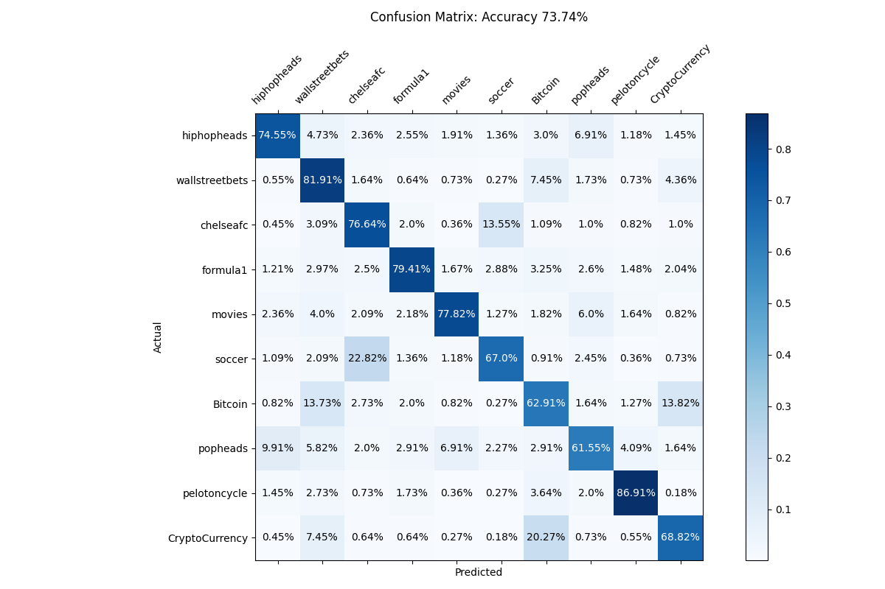
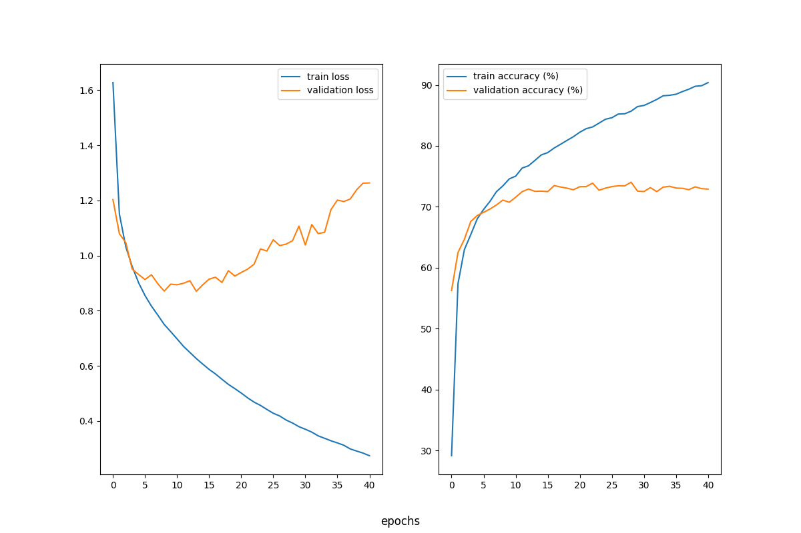

# About

A transformer classifier trained on comments from 10 popular subreddits. The
subreddits choosen all have a popular "discussion" chat post and 100 comments
were scraped using `praw` from the last 100 "discussion" posts of the
subreddits. All of the discussion posts except the `movies` posts shared a
common theme. The `movies` "discussion" posts were all "discussions" about a
particular movie, like [this
post](https://www.reddit.com/r/movies/comments/1b3jo9s/official_discussion_dune_part_two_spoilers/)
, while the "discussion" posts from the other subreddits were all general
"daily discussion" type posts [this this soccer
post](https://www.reddit.com/r/soccer/comments/1cdcxww/daily_discussion/) for
examples. The latest comments in the dataset occured on April 11, so any
comment created after April 11 will be new to the model.

# Some Results

Below are the results of the transformer on the testing data after 40 epochs of
training and validating. The transformer had 6 "multihead attention" layers
with 4 heads each and an embedded dimension of 256. A max token length of 256
was also chosen. The full configuration of the experiment is in
`./run_experiment/all_6layers_bs64_256emb_4hd`. I saved the best model based on
validation accuracy, which occured on the 29th epoch.

 

 
