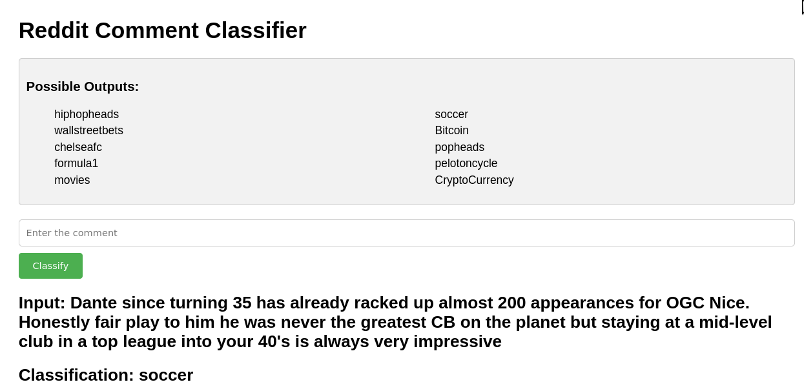

# About 
A transformer classifier trained on comments from the following 10 popular
subreddits: Bitcoin, CryptoCurrency, hiphopheads, pelotoncycle, soccer
chelseafc, formula1, movies, popheads, wallstreetbets. The subreddits choosen
all have a popular "discussion" chat post and at most 100 comments were scraped
using `praw` from the last 100 discussion posts of the subreddits. Oddly
enough, these were the only subreddits that I could seem to find that had a
reocurring chat that conistantly had atleast 100 comments in it. 

All of the comments scraped are found in `./data.tar.gz` and can be unzipped
with `tar -xzvf data.tar.gz`. The unzipped data folder is of the following
form.

```
data
├── <subreddit name>
│   ├── test
│   │    └──<submission_id>_<comment_id>.txt 
│   │    └──...
│   ├── train
│   │    └──<submission_id>_<comment_id>.txt 
│   │    └──...
│   └── val
│        └──<submission_id>_<comment_id>.txt 
│        └──...
```

Above, `<submission_id>` and `<comment_id>` refer `praw.models.Submission.id` 
and `praw.models.Comment.id` and each `txt` has exactly one comment in it. The 
comment has been lowed and stripped of all non asci characters which was
handled by `src.data.utils.lower_text_and_remove_all_non_asci`.

All of the discussion posts except the `movies` posts shared a common theme.
The `movies` discussion posts were all discussions about a particular movie,
like [this post](https://www.reddit.com/r/movies/comments/1b3jo9s/official_discussion_dune_part_two_spoilers/), 
while the discussion posts from the other subreddits were all general "daily
discussion" type posts [like this soccer post](https://www.reddit.com/r/soccer/comments/1cdcxww/daily_discussion/) 
for examples. The latest comments in the dataset occured on April 11, 2024, so
any comment created after April 11 will be new to the model.


# Some Results 
Below are the results of the transformer on the testing data
after 40 epochs of training and validating. The transformer had 6 "multihead
attention" layers with 4 heads each and an embedded dimension of 256. A max
token length of 256 was also chosen. The full configuration of the experiment
is in `./experiment/config.py`. I saved the best model based on validation
accuracy, which occured on the 29th epoch.

 

 


# Try it out 
There is an app in `./app`. To try it out you will need the
weights [found
here](https://drive.google.com/drive/folders/1MdYmlTaZhMoeRNwAw3jc0pDtTFLvWMH-).
The following will clone the repo and download the weights with `gdown` and
install some of the requirements.

```bash 
git clone https://github.com/nickeisenberg/reddit_classifier.git 
cd reddit_classifier 
gdown https://drive.google.com/uc?id=1R7JVUWz5h02T8c7UqsWI8pZjkDjfKvKa 
mv validation_ckp.pth app 
pip install -r rec.app.txt 
```

You also need to install the `cpu` version of `pytorch` for your OS found
[here](https://pytorch.org/). Then you can start the app with `python3 app`.

Alternatively you can pull the docker image and run it with 
```bash 
docker pull nickeisenberg/reddit-comment-classifier:v0.0 
docker run -p 5000:5000 nickeisenberg/reddit-comment-classifier:v0.0 
```

# Small Demo 
Here are two comments from April 27th's
[soccer](https://www.reddit.com/r/soccer/comments/1ce59q1/comment/l1h5nzl/?utm_source=share&utm_medium=web3x&utm_name=web3xcss&utm_term=1&utm_content=share_button)
and
[chelseafc](https://www.reddit.com/r/chelseafc/comments/1cdcy2m/comment/l1fvy53/?utm_source=share&utm_medium=web3x&utm_name=web3xcss&utm_term=1&utm_content=share_button)
daily discussion

* Soccer: Dante since turning 35 has already racked up almost 200 appearances
  for OGC Nice. Honestly fair play to him he was never the greatest CB on the
  planet but staying at a mid-level club in a top league into your 40's is
  always very impressive

   

* Chelseafc: Knowing he is for sale , Martín Zubimendi is the defensive
  midfielder we should have went in for over Caicedo.

   
