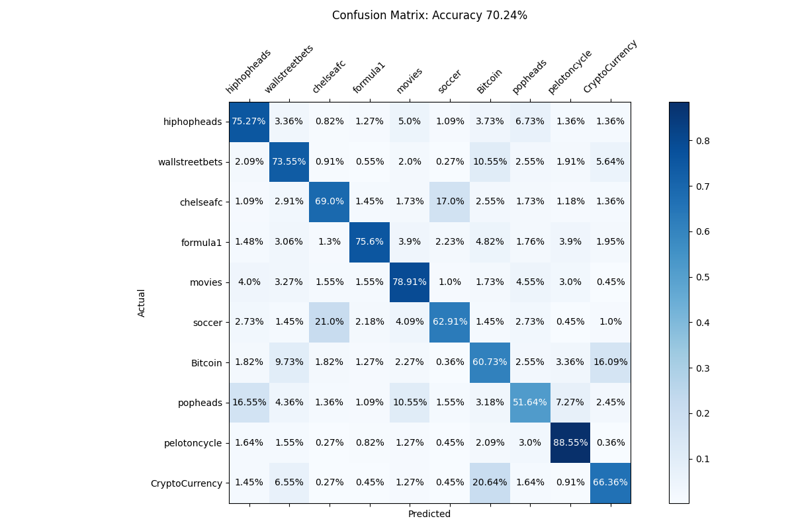

# About

A transformer classifer trained on comments from 10 popular subreddits.
The subreddits choosen all have a popular "Daily" chat post and 100 comments
were scraped from the last 100 "Daily" posts of each of the subreddits. The 
comments were scraped using `praw` and latest comments in the dataset occured
on April 11. So the comments from any "Discussion" post created after April 11
will be new to the model.

# Some Results

Below are the results of the transformer on the testing data after 20 epochs.
There are several groups of similar subreddits that cause confusion to the
model. First wallstreetbets, CryptoCurrency and Bitcon get confused for
one another. Similarly popheads, hiphopheads and movies get confused with
one another. Lastly soccer and chealsefc get confused.

 


If we collapse the above classes by group and retrain the transformer, then 
results are much better. I collaped the classes as follows:
```
    finance = ["Bitcoin", "CryptoCurrency", "wallstreetbets"]
    soccer = ["soccer", "chelseafc"]
    pop_culture = ["movies", "popheads", "hiphopheads"]
    pelotoncycle = "pelotoncycle"
    formula1 = "formula1"
```

 
